# Project Akhir ASD Kelompok 3
# Program Peluang Kerja Untuk Semua: Membantu Masyarakat Menemukan Pekerjaan Yang Sesuai Dengan Mudah

_Anggota Kelompok:_

*• Joshua Timothy (2309116070)*

*• Aqiyah Zulqiyah (2309116075)*

*• Allya Putri Ditya (2309116078)*

*• Reisya Nurfaris D. A. (2309116102)*

## **Deskripsi Program**

### ⭐️1. Tujuan Program

_Program ini bertujuan untuk membantu masyarakat secara menyeluruh dalam menemukan pekerjaan dengan lebih mudah dan efisien. Kami memahami tantangan yang dihadapi banyak orang dalam mencari pekerjaan dikarenakan proses rekrutmen yang rumit. Dengan menyediakan platform yang mempermudah penelusuran lowongan kerja melalui berbagai filter dan kategori, serta meningkatkan akses informasi dengan detail yang akurat tentang deskripsi pekerjaan dan kualifikasi yang dibutuhkan, kami berharap dapat membantu pencari kerja menemukan pekerjaan yang sesuai dengan minat dan keterampilan mereka._

### ⭐️2. Pengguna Program

_Program ini memiliki beberapa jenis pengguna, dengan peran dan akses yang berbeda:_

      Admin:
      - Memiliki hak istimewa untuk mengelola data lowongan, termasuk:
        a. Menyetujui atau menolak permintaan untuk mengelola lowongan.
        b. Mengelola data pengguna (menambahkan, menghapus, dan mengedit).
        c. Mengelola data perusahaan (menambahkan, menghapus, dan mengedit).
        d. Mengelola data lamaran (menambahkan, menghapus, dan mengedit).
      - Setiap admin memiliki akses ke lowongan yang berbeda.
      
      User/Pelamar:
      - Memiliki hak istimewa untuk:
        a. Mencari lowongan berdasarkan berbagai filter dan kategori.
        b. Mengisi formulir lamaran secara cepat dan mudah.
        c. Melacak status lamaran mereka.
        d. Berkomunikasi dengan perusahaan secara langsung.

      Perusahaan:
      - Memiliki hak istimewa untuk:
        a. Mengedit profil perusahaan mereka.
        b. Melihat semua lamaran yang masuk ke perusahaan mereka.
        c. Menghapus lamaran.
        d. Melihat semua lowongan yang mereka buat.
        e. Menghapus dan mengedit lowongan.
        f. Memasukkan data lowongan baru.

### ⭐️3. Struktur Database

_Database program ini dirancang menggunakan struktur MySQL dengan 5 entitas utama:_

      1. Admin:
         - Atribut:
           - id_admin (primary key)
           - username
           - password
           - jabatan
      
      2. Lamaran:
         - Atribut:
           - id_lamaran (primary key)
           - id_perusahaan (foreign key)
           - id_user (foreign key)
           - id_lowongan (foreign key)
           - sumber_informasi
           - pengalaman_relevan
           - deskripsi
      
      3. Lowongan:
         - Atribut:
           - id_lowongan (primary key)
           - id_perusahaan (foreign key)
           - id_admin (foreign key)
           - klasifikasi
           - tipe
           - deskripsi
           - posisi
           - ketentuan
           - gaji

      4. Perusahaan:
         - Atribut:
           - id_perusahaan (primary key)
           - nama_perusahaan
           - password
           - no_telp
           - email_perusahaan
           - alamat_perusahaan
      
      5. User:
         - Atribut:
           - id_user (primary key)
           - nama
           - password
           - email
           - no_telp
           - pendidikan
           - pengalaman
           - keahlian
           - jenis_kelamin
           - alamat

## Struktur Program

### Halaman Log in
- *Proses Memilih Log in sebagai Admin*

- *Proses Log in sebagai User/Pelamar*

- *Proses Log in sebagai Perusahaan*

- *Proses kembali ke menu sebelumnya*

- *Proses Registrasi akun user atau registrasi akun perusahaan*
-Login_1.jpg)
Jika pengguna belum memiliki akun, program menyediakan opsi registrasi. pengguna menginputkan data-data yang dibutuhkan oleh program sebelum masuk ke dalam menu utama.

- *Proses keluar dari program*

### Halaman Menu Admin
- *Proses memilih mengelola lowongan, user, perusahaan, atau lamaran*
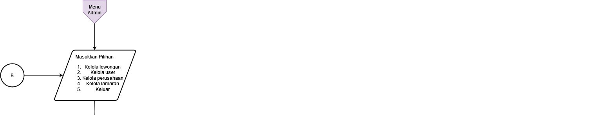
Di dalam menu admin, admin mempunyai fitur untuk mengedit dan menghapus pada lowongan,user,perusahaan, atau lamaran. 

- *Proses mengelola lowongan*
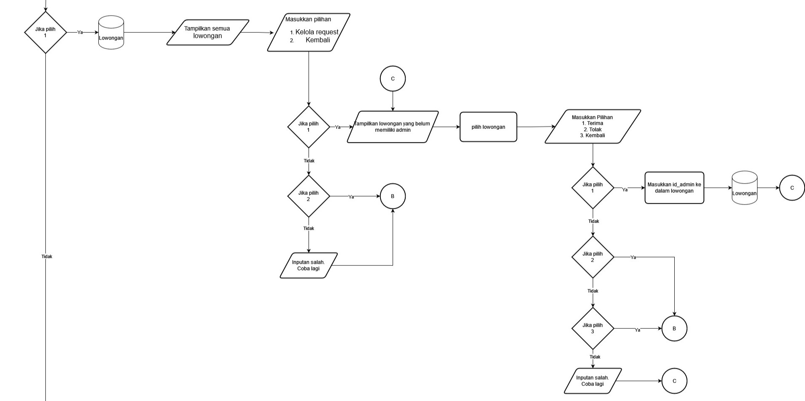
Pada fitur mengelola lowongan, admin dapat menerima atau menolak request lowongan yang diajukan oleh perusahaan.

- *Proses mengelola user*
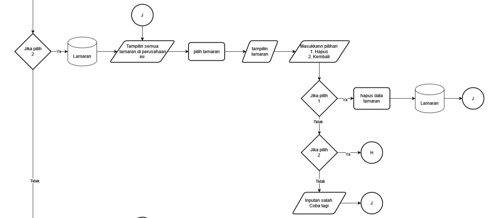
Pada fitur ini, admin dapat menghapus user dalam program ini.

- *Proses mengelola perusahaan*
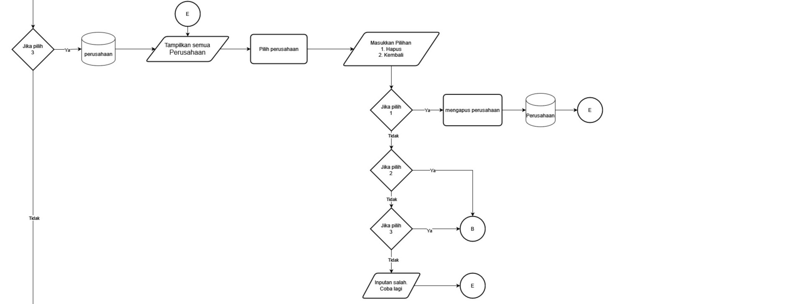
Sama halnya dengan fitur user, admin dapat menghapus perusahaan dalam program ini.

- *Proses mengelola lamaran*
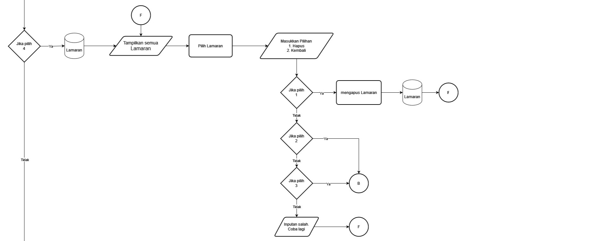
Begitu juga dengan fitur lamaran, admin dapat menghapus lamaran dalam program ini.

- *Proses Admin kembali ke menu log in*
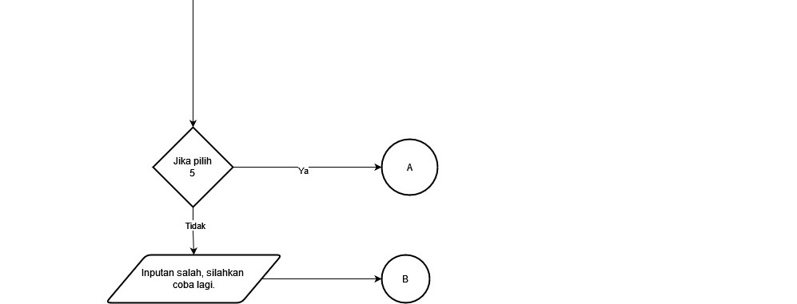

### Halaman Menu User
- *Proses user memilih lowongan*
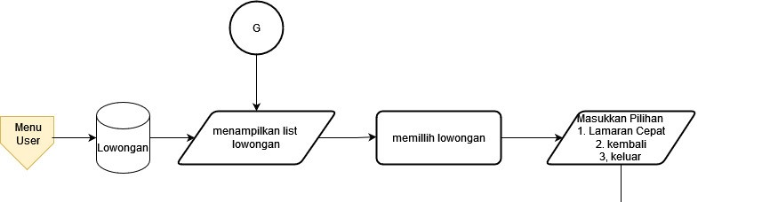
Pada halaman menu user memiliki fitur Lamaran cepat.

- *Proses user mengisi lamaran cepat dan di bawahnya keluar kemenu sebelumnya*
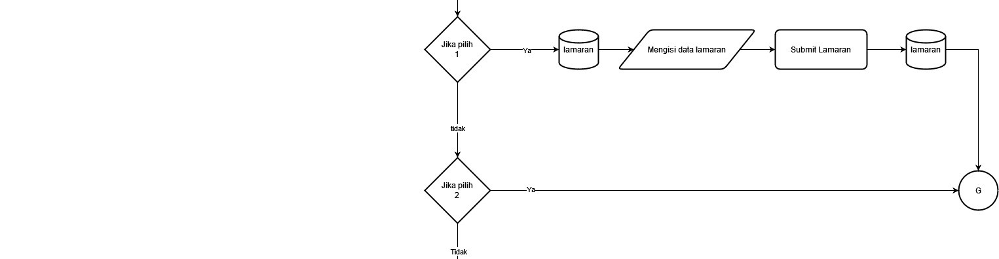
Fitur Lamaran cepat, template lamaran yang sudah disediakan dari program. jadi user hanya perlu menginputkan data yang diperlukan oleh program.

- *Proses user memilih keluar ke menu log in*

### Halaman Menu Perusahaan
- *Proses memilih melihat profil perusahaan, lihat lamaran atau lihat lowongan*
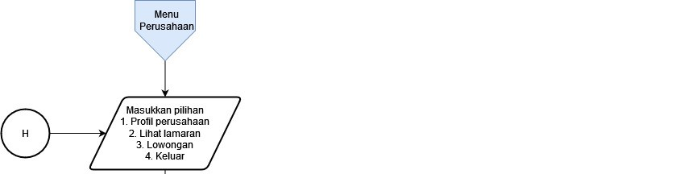
Pada halaman menu perusahaan memiliki fitur mengedit menghapus dan melihat data tertentu.

- *Proses perusahaan mengedit profil perusahaan*
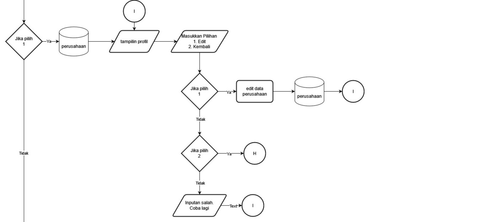
Pada fitur Profil perusahaan, perusahaan dapat mengedit biodatanya.

- *Proses melihat daftar lamaran dan menghapus data lamaran*
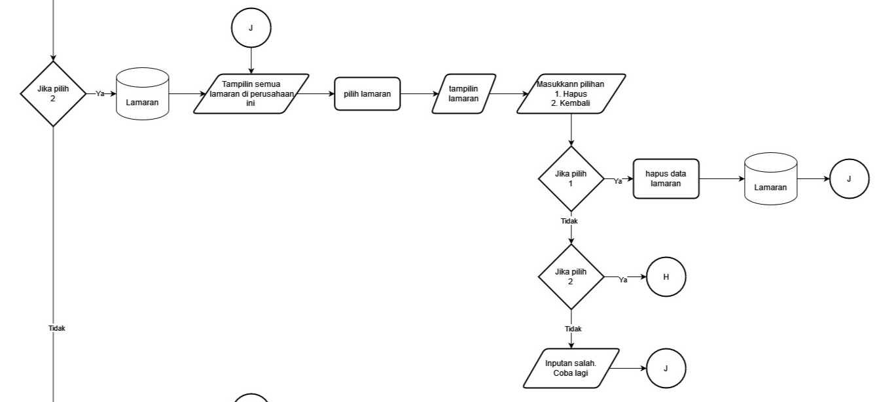
Pada fitur Lihat lamaran, perusahaan dapat menghapus lamaran.

- *Proses melihat daftar lowongan, memilih lowongan untuk dihapus atau diedit*
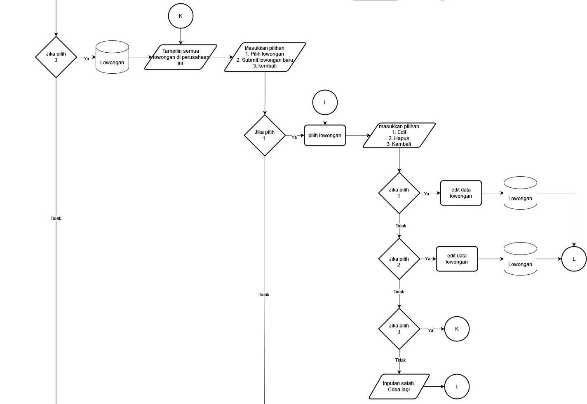
Pada fitur Lowongan, perusahaan dapat mengedit dan menghapus lowongan yang sebelumnya sudah terdaftar dalam program. perusahaan juga dapat menambahkan lowongan baru.

- *Proses perusahaan submit lowongan baru, kembali ke menu sebelumnya*
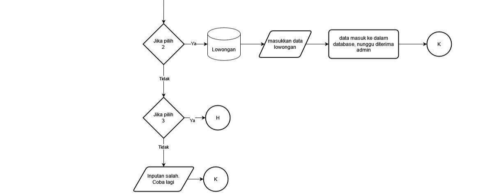
Pada fitur Submit lowongan baru, perusahaan dapat menambahkan lowongan kerja dalam program namun lowongan baru tersebut tidak bisa langsung ditampilkan, harus disetujui oleh admin terlebih dahulu untuk ditampilkan.

- *Proses perusahaan memilih keluar ke menu log in*
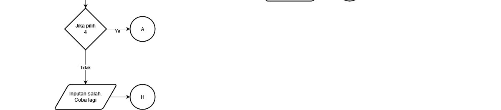
