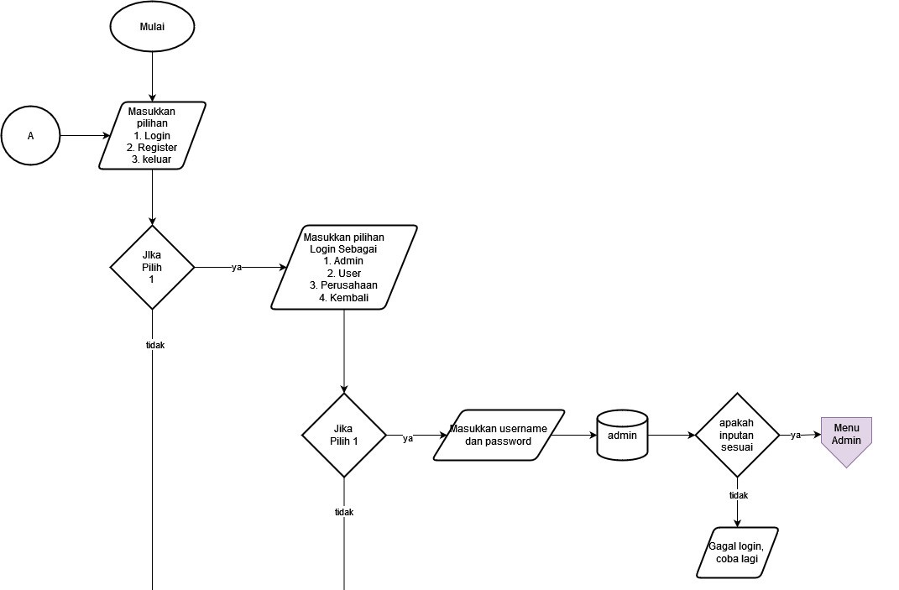
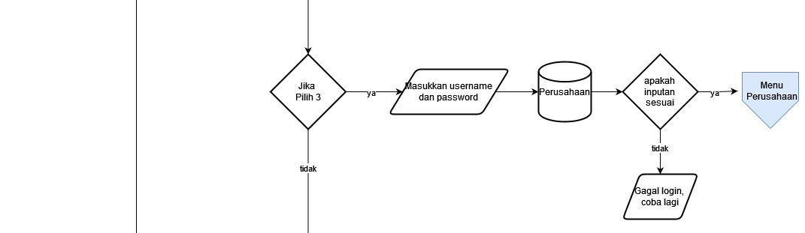
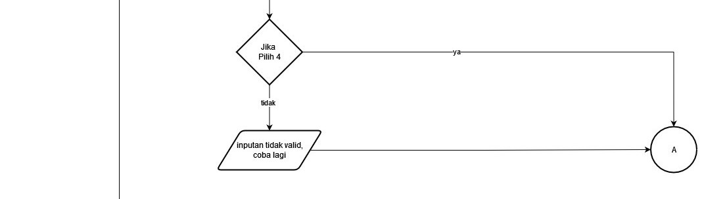
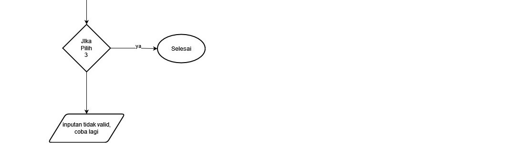

# Project Akhir ASD Kelompok 3
# Program Peluang Kerja Untuk Semua: Membantu Masyarakat Menemukan Pekerjaan Yang Sesuai Dengan Mudah

_Anggota Kelompok:_

*• Joshua Timothy (2309116070)*

*• Aqiyah Zulqiyah (2309116075)*

*• Allya Putri Ditya (2309116078)*

*• Reisya Nurfaris D. A. (2309116102)*

## **Deskripsi Program**

### ⭐️1. Tujuan Program

_Program ini bertujuan untuk membantu masyarakat secara menyeluruh dalam menemukan pekerjaan dengan lebih mudah dan efisien. Kami memahami tantangan yang dihadapi banyak orang dalam mencari pekerjaan dikarenakan proses rekrutmen yang rumit. Dengan menyediakan platform yang mempermudah penelusuran lowongan kerja melalui berbagai filter dan kategori, serta meningkatkan akses informasi dengan detail yang akurat tentang deskripsi pekerjaan dan kualifikasi yang dibutuhkan, kami berharap dapat membantu pencari kerja menemukan pekerjaan yang sesuai dengan minat dan keterampilan mereka._

### ⭐️2. Pengguna Program

_Program ini memiliki beberapa jenis pengguna, dengan peran dan akses yang berbeda:_

      Admin:
      - Memiliki hak istimewa untuk mengelola data lowongan, termasuk:
        a. Menyetujui atau menolak permintaan untuk mengelola lowongan.
        b. Mengelola data pengguna (menambahkan, menghapus, dan mengedit).
        c. Mengelola data perusahaan (menambahkan, menghapus, dan mengedit).
        d. Mengelola data lamaran (menambahkan, menghapus, dan mengedit).
      - Setiap admin memiliki akses ke lowongan yang berbeda.
      
      User/Pelamar:
      - Memiliki hak istimewa untuk:
        a. Mencari lowongan berdasarkan berbagai filter dan kategori.
        b. Mengisi formulir lamaran secara cepat dan mudah.
        c. Melacak status lamaran mereka.
        d. Berkomunikasi dengan perusahaan secara langsung.

      Perusahaan:
      - Memiliki hak istimewa untuk:
        a. Mengedit profil perusahaan mereka.
        b. Melihat semua lamaran yang masuk ke perusahaan mereka.
        c. Menghapus lamaran.
        d. Melihat semua lowongan yang mereka buat.
        e. Menghapus dan mengedit lowongan.
        f. Memasukkan data lowongan baru.

### ⭐️3. Struktur Database

_Database program ini dirancang menggunakan struktur MySQL dengan 5 entitas utama:_

      1. Admin:
         - Atribut:
           - id_admin (primary key)
           - username
           - password
           - jabatan
      
      2. Lamaran:
         - Atribut:
           - id_lamaran (primary key)
           - id_perusahaan (foreign key)
           - id_user (foreign key)
           - id_lowongan (foreign key)
           - sumber_informasi
           - pengalaman_relevan
           - deskripsi
      
      3. Lowongan:
         - Atribut:
           - id_lowongan (primary key)
           - id_perusahaan (foreign key)
           - id_admin (foreign key)
           - klasifikasi
           - tipe
           - deskripsi
           - posisi
           - ketentuan
           - gaji

      4. Perusahaan:
         - Atribut:
           - id_perusahaan (primary key)
           - nama_perusahaan
           - password
           - no_telp
           - email_perusahaan
           - alamat_perusahaan
      
      5. User:
         - Atribut:
           - id_user (primary key)
           - nama
           - password
           - email
           - no_telp
           - pendidikan
           - pengalaman
           - keahlian
           - jenis_kelamin
           - alamat

## Struktur Program

### Halaman Log in
- *Proses Memilih Log in sebagai Admin*

- *Proses Log in sebagai User/Pelamar*

- *Proses Log in sebagai Perusahaan*

- *Proses kembali ke menu sebelumnya*

- *Proses Registrasi akun user atau registrasi akun perusahaan*
-Login1.jpg)
Jika pengguna belum memiliki akun, program menyediakan opsi registrasi. pengguna menginputkan data-data yang dibutuhkan oleh program sebelum masuk ke dalam menu utama.

- *Proses keluar dari program*

### Halaman Menu Admin
- *Terdapat pilihan melihat profil, mengelola lowongan, user, perusahaan, atau lamaran*
-Admin1.jpg)

Di dalam menu admin, admin mempunyai fitur untuk mengedit dan menghapus pada lowongan,user,perusahaan, atau lamaran. 

- *Untuk melihat/menampilkan profil*
-Admin2.jpg)
Pada fitur menampilkan profil, admin dapat mengedit profil admin.

- *Proses mengelola lowongan*
-Admin3.jpg)
Pada fitur ini, admin dapat menampilkan profil lowongan yang dipilih untuk dihapus, mengurutkan lowongan, dan juga mencari lowongan menggunakan keyword.

- *Proses mengelola user*
-Admin4.jpg)
Sama halnya dengan fitur lowongan, admin dapat menampilkan profil user yang dipilih untuk dihapus, mengurutkan data user, dan juga mencari user menggunakan keyword.

- *Proses mengelola perusahaan*
-Admin5.jpg)
Begitu juga dengan fitur perusahaan, admin dapat menampilkan profil perusahaan yang dipilih untuk dihapus, mengurutkan data perusahaan, dan juga mencari perusahaan menggunakan keyword.

- *Proses mengelola lamaran*
-Admin6.jpg)
Terakhir dengan fitur lamaran, admin dapat menampilkan profil lamaran yang dipilih untuk dihapus, mengurutkan data lamaran, dan juga mencari lamaran menggunakan keyword.

- *Proses Admin kembali ke menu log in*
-Admin7.jpg)

### Halaman Menu User
- *Pilihan untuk memilih user ingin melihat profil atau melihat daftar lowongan*
-User1.jpg)

- *Menampilkan Profil User*
-User2.jpg)
Pada fitur ini user bisa mengedit profil yang dimiliki user itu sendiri.

- *Proses user melihat list lowongan yang tersedia*
-User3.jpg)
Pada fitur ini, user dapat memilih lowongan yang dinginkan dan dapat mengisi lamaran cepat yang berisi format lamaran yg telah disediakan. Selain itu, user juga dapat melakukan sorting berdasarkan pilihan yg diinginkan dan dapat melakukan searching berdasarkan keyword yg dimasukkan.

- *Proses user memilih kembai ke menu utama*
  
-User4.jpg)

### Halaman Menu Perusahaan
- *Proses memilih melihat daftar lamaran, melihat profil perusahaan, atau mengelola lowongan*
-Perusahaan1.jpg)

Pada halaman menu perusahaan memiliki fitur mengedit menghapus dan melihat data tertentu.

- *Proses melihat daftar lamaran dan menghapus data lamaran*
-Perusahaan2.jpg)
Pada fitur Lihat lamaran, perusahaan dapat memilih lamaran yang ingin dihapus, dapat mengurutkan daftar lowongan, dan dapat mencari lowongan yang diingin dengan fitur searching.

- *Proses mengedit profil perusahaan*
-Perusahaan3.jpg)
Pada fitur ini, perusahaan dapat mengedit profil perusahaannya sendiri.

- *Menampilkan seluruh lowongan yang sudah di submit*
-Perusahaan4.jpg)

- *Proses mengedit profil perusahaan, sorting, dan searching*
-Perusahaan5.jpg)
Pada fitur ini, perusahaan dapat memilih lowongan yang ingin dihapus atau diedit, dapat mengurutkan berdasarkan pilihannya, dan dapt melakukan pencarian berdasarkan keyword yang ingin diinginkan.

- *Proses perusahaan submit lowongan baru, kembali ke menu sebelumnya*
-Perusahaan6.jpg)
Pada fitur Submit lowongan baru, perusahaan dapat menambahkan lowongan kerja dalam program namun lowongan baru tersebut tidak bisa langsung ditampilkan, harus disetujui oleh admin terlebih dahulu untuk ditampilkan.

- *Proses perusahaan memilih keluar ke menu log in*
  
-Perusahaan7.jpg)

- *Fungsionalitas*
  
#(built-in)

1. **`import os`**: Modul `os` memberikan alat untuk berinteraksi dengan sistem operasi, seperti mengelola file dan direktori, mengakses variabel lingkungan, dan menjalankan perintah shell.

2. **`import math`**: Modul `math` menyediakan fungsi matematika dasar, seperti perhitungan akar kuadrat, sinus, kosinus, dan logaritma.

#(external)

1. **`import mysql.connector`**: Ini memungkinkan koneksi dan manipulasi database MySQL dari Python.

2. **`from pwinput import pwinput`**: Ini memungkinkan input password yang aman.

3. **`from prettytable import PrettyTable`**: Ini digunakan untuk membuat dan mencetak tabel yang rapi di konsol.

-Class Node

Fungsi kelas “Node”. Setiap node dalam linked list akan memiliki atribut “data” untuk menyimpan nilai dan atribut “next” untuk menunjukkan ke node berikutnya dalam linked list.

-Class LinkedList

#(fungsi def init)

*Class LinkedList adalah salah satu struktur data yang yang terdiri dari node-node yang terhubung satu sama lain. Dalam Class LinkedList, fungsi def init dan self berperan sebagai konstruktor untuk membuat instance dari class tersebut

*Nantinya setiap method dalam linked list akan memiliki parameter self. Dengan menggunakan parameter self kita dapat mengakses atribut-atribut yang ada pada Class LinkedList

#(fungsi def append)

* Method ini berfungsi untuk menambahkan node baru di bagian akhir linked list. Method kemudian akan membuat istance baru dari class Node dan menyimpan data pada node tersebut.

#(fungsi def display)

* ini berfungsi untuk menampilkan seluruh data-data yang berada di dalam database yang kemudian tersusun di dalam table berkat bantuan dari library prettytable.

#(fungsi def getitem)

* biar bisa langsung pakai list[index] macam array biasanya

#(fungsi def iter (self))

* biar bisa pakai for loop 

#(fungsi def len (self))

* biar bisa pakai len()

-Class MySQLHandler

#(def init)

1.Kelas MySQLHandler merupakan kerangka kerja untuk mengelola koneksi dan operasi database MySQL.

2.Fungsi __init__ digunakan untuk menginisialisasi objek MySQLHandler dengan informasi koneksi yang diberikan.

#(def connect)

* Fungsi connect(self) dalam kelas MySQLHandler bertujuan untuk membuat koneksi ke server MySQL menggunakan informasi yang telah diberikan saat objek MySQLHandler diinisialisasi.

#(def execute)

* Fungsi execute dalam sebuah kelas yang berhubungan dengan database, biasanya digunakan untuk mengeksekusi perintah SQL ke dalam database yang terhubung.

#(def fetchall)

* Fungsi fetchall digunakan dalam koneksi basis data untuk mengambil semua baris hasil dari sebuah query yang dieksekusi.

#(def fetchone)

* Fungsi fetchone dalam koneksi basis data digunakan untuk mengambil satu baris hasil dari sebuah query yang dieksekusi. 

#(def description)

* Fungsi description biasanya digunakan untuk mengembalikan deskripsi kolom dari hasil query.

#(def commit)

* Fungsi commit dalam konteks basis data digunakan untuk menyimpan perubahan yang telah dilakukan dalam transaksi ke dalam basis data secara permanen.

#(def close)

* Fungsi close dalam konteks koneksi basis data digunakan untuk menutup koneksi atau kursor yang telah dibuka.

-Class Admin

#(def login)

* Kelas `Admin` adalah representasi dari administrator dalam sebuah sistem atau aplikasi. Admin memiliki akses dan kekuatan lebih dalam mengelola sistem dibandingkan pengguna biasa. Ini dapat mencakup atribut seperti username, password, role, email, dan metode untuk mengelola sistem, seperti menambah, menghapus, atau memperbarui informasi pengguna dan data lainnya.

*Fungsi Login adalah program yang digunakan untuk menampilkan perintah terkait login sebelum masuk ke dalam aplikasi, di dalamnya terdapat percabangan(if, elif, else) yang digunakan untuk mengeksekusi kode tertentu hanya jika kondisi tersebut terpenuhi.

1.Membersihkan Layar: Fungsi clear() dipanggil untuk membersihkan layar konsol sebelum tampilan login dimulai.

2.Input Username: Pengguna diminta untuk memasukkan username mereka.

3.Query Database: Fungsi execute digunakan untuk menjalankan perintah SQL yang mencari admin dengan username yang cocok dalam tabel admin.

4.Pengecekan Username: Jika admin dengan username tersebut ditemukan dalam database, pengguna diminta untuk memasukkan password mereka.

5.Validasi Password: Password yang dimasukkan oleh pengguna dibandingkan dengan password yang disimpan dalam database. Jika cocok, pengguna berhasil masuk ke sistem dan menu admin ditampilkan. Jika tidak, pesan kesalahan ditampilkan.

6.Tindakan untuk Username Tidak Terdaftar: Jika admin dengan username yang dimasukkan tidak ditemukan dalam database, pesan kesalahan ditampilkan.

#(def profil)

Fungsi `profil` digunakan untuk menampilkan profil admin saat ini beserta jabatan dan hak akses yang dimilikinya. Berikut adalah penjelasan singkat tentang fungsi ini:

1. **Query Database**: Fungsi `execute` digunakan untuk menjalankan perintah SQL yang mencari admin dengan ID admin yang sedang aktif dalam tabel admin.

2. **Pengolahan Data**: Jika data admin ditemukan dalam database, informasi admin disimpan dalam variabel `admin_data`.

3. **Tampilan Profil**: Informasi admin, seperti username, ID, dan jabatan, ditampilkan ke layar.

4. **Hak Akses**: Hak akses admin ditampilkan berdasarkan jabatan. Berbagai aksi yang dapat dilakukan oleh admin ditampilkan dengan warna yang sesuai.

#(def menu)

Fungsi `menu` adalah bagian dari sistem yang bertanggung jawab untuk menampilkan menu utama admin, memungkinkan mereka untuk memilih dan melakukan berbagai tindakan terkait manajemen sistem. Berikut adalah penjelasan singkat tentang fungsi ini:

1. **Tampilan Menu Utama**: Fungsi `choices` digunakan untuk menampilkan pilihan menu utama kepada admin. Admin dapat memilih dari berbagai opsi, seperti melihat profil, mengelola lowongan, mengelola user, mengelola perusahaan, mengelola lamaran, atau keluar dari sistem.

2. **Pilihan Profil Admin**: Jika admin memilih opsi "Profil", fungsi `profil` dari kelas `Admin` dipanggil untuk menampilkan profil admin saat ini. Admin juga diberikan opsi untuk mengedit data profilnya.

3. **Pilihan Kelola Lowongan**: Jika admin memilih opsi "Kelola Lowongan", mereka dapat memilih untuk melihat, mengurutkan, mencari, atau mengelola lowongan pekerjaan yang ada dalam sistem.

4. **Pilihan Kelola User**: Admin dapat memilih opsi "Kelola User" untuk melihat, mengurutkan, mencari, atau menghapus pengguna (user) dalam sistem.

5. **Pilihan Kelola Perusahaan**: Admin dapat memilih opsi "Kelola Perusahaan" untuk melihat, mengurutkan, mencari, atau menghapus perusahaan yang terdaftar dalam sistem.

6. **Pilihan Kelola Lamaran**: Admin dapat memilih opsi "Kelola Lamaran" untuk melihat, mengurutkan, mencari, atau menghapus lamaran pekerjaan yang telah diajukan oleh pengguna.

7. **Keluar dari Menu**: Admin dapat memilih opsi "Keluar" dari menu utama untuk keluar dari sistem.

-Class User

#(def register)

Fungsi `register` dalam kelas `User` bertujuan untuk memungkinkan pengguna untuk mendaftar ke dalam sistem. Berikut penjelasan singkat tentang fungsi ini:

1. **Input Data**: Pengguna diminta untuk memasukkan informasi pribadi seperti email, password, nama, jenis kelamin, nomor telepon, pendidikan, alamat, pengalaman, dan keahlian.

2. **Validasi Email**: Sistem memeriksa apakah email yang dimasukkan pengguna telah digunakan sebelumnya. Jika belum, proses pendaftaran dilanjutkan; jika sudah, pengguna diminta untuk menggunakan email lain.

3. **Penyimpanan Data**: Informasi yang dimasukkan oleh pengguna disimpan ke dalam tabel user dalam basis data.

4. **Konfirmasi Pendaftaran**: Pengguna diberikan konfirmasi bahwa akun mereka telah berhasil dibuat.

5. **Kembali ke Menu**: Setelah pendaftaran berhasil, pengguna diarahkan kembali ke menu utama.

Ini adalah kerangka umum dari fungsi `register` yang memanfaatkan berbagai fungsi bantuan seperti `inputhandler` (untuk validasi input) dan `choices` (untuk memilih jenis kelamin). Fungsi-fungsi lainnya terkait dengan operasi basis data seperti eksekusi perintah SQL dan manipulasi data yang diperlukan untuk pendaftaran pengguna.

#(def login)

Fungsi login dalam kelas User bertujuan untuk memungkinkan pengguna untuk masuk ke dalam sistem. Berikut penjelasan lebih detail tentang fungsi ini:

Input Data: Pengguna diminta untuk memasukkan email dan password mereka menggunakan fungsi inputhandler. Ini membantu memastikan bahwa input yang dimasukkan sesuai dengan format yang diinginkan.

Query Database: Sistem menggunakan perintah SQL untuk mencari pengguna berdasarkan email yang dimasukkan. Ini dilakukan dengan pernyataan SELECT yang mencocokkan email yang dimasukkan pengguna dengan email yang ada dalam tabel user.

Validasi Pengguna: Jika email yang dimasukkan oleh pengguna ditemukan dalam database, sistem membandingkan password yang dimasukkan oleh pengguna dengan password yang tersimpan dalam database. Jika keduanya cocok, pengguna dianggap berhasil masuk.

Tindakan Setelah Login: Jika login berhasil, pengguna diberikan pesan selamat datang yang mencakup nama pengguna, dan kemudian diarahkan ke menu utama menggunakan fungsi User.menu().

#(def profil)

Fungsi `profil` dalam kelas `User` bertujuan untuk menampilkan profil pengguna. Berikut adalah penjelasan singkat tentang fungsi ini:

1. **Parameter Opsional**: Fungsi ini menerima parameter opsional `user_id`, yang merupakan ID pengguna yang ingin ditampilkan profilnya. Jika tidak ada `user_id` yang diberikan, fungsi akan mencoba menggunakan `user_data` global, yang berisi informasi pengguna yang saat ini login.

2. **Query Database**: Sistem menggunakan perintah SQL untuk mencari pengguna berdasarkan `user_id` yang diberikan atau ID pengguna yang tersimpan dalam `user_data`.

3. **Validasi Pengguna**: Jika pengguna dengan `user_id` yang diberikan ditemukan dalam database, informasi mereka akan ditampilkan. Jika tidak, akan ada pesan yang memberi tahu bahwa pengguna dengan ID tersebut tidak ditemukan.

4. **Menampilkan Profil**: Setelah mendapatkan informasi pengguna dari database, profil pengguna ditampilkan dengan menggunakan data yang ditemukan, seperti nama, jenis kelamin, alamat, email, nomor telepon, pendidikan terakhir, pengalaman, dan keahlian.

#(def list)

Fungsi `list` dalam kelas `User` bertujuan untuk menampilkan daftar pengguna dalam format yang rapi. Berikut adalah penjelasan singkat tentang fungsi ini:

1. **Parameter Opsi**: Fungsi ini menerima beberapa parameter opsional, termasuk `sort_key` untuk menentukan kunci pengurutan, `sort_order` untuk menentukan urutan pengurutan, dan `keyword` untuk pencarian khusus.

2. **Query Database**: Sistem menggunakan perintah SQL untuk mengambil data pengguna dari database. Data ini kemudian diubah menjadi struktur data yang lebih mudah diolah.

3. **Pengurutan dan Pencarian**: Pengguna memiliki opsi untuk mengurutkan daftar pengguna berdasarkan kriteria tertentu, dan juga melakukan pencarian berdasarkan kata kunci yang diberikan.

4. **Menampilkan Data**: Jika ada pengguna yang ditemukan, data mereka ditampilkan menggunakan `PrettyTable` untuk format yang rapi. Setiap baris tabel mencakup nomor urut, nama pengguna, email, dan ID pengguna.

5. **Penanganan Kasus Kosong**: Jika tidak ada pengguna yang ditemukan atau daftar pengguna kosong, pesan yang sesuai dicetak untuk memberi tahu pengguna bahwa tidak ada data yang tersedia untuk ditampilkan.

#(def pilih)

 Fungsi `pilih` bertujuan untuk memungkinkan pengguna memilih satu dari daftar pengguna yang ditampilkan. Berikut adalah penjelasan singkat tentang fungsi ini:

1. **Pemilihan Pengguna**: Pengguna diminta untuk memasukkan nomor yang terkait dengan pengguna yang ingin mereka pilih dari daftar yang ditampilkan.

2. **Validasi Nomor**: Sistem memvalidasi nomor yang dimasukkan oleh pengguna untuk memastikan bahwa nomor tersebut sesuai dengan nomor yang terdaftar dalam daftar pengguna.

3. **Penetapan Pengguna Dipilih**: Jika nomor yang dimasukkan valid, ID pengguna terkait ditetapkan sebagai `selected_user`, yang dapat digunakan untuk operasi lebih lanjut.

4. **Penanganan Kasus Tidak Valid**: Jika nomor yang dimasukkan tidak valid (misalnya, di luar rentang nomor yang tersedia), pesan yang sesuai dicetak untuk memberi tahu pengguna bahwa nomor tersebut tidak valid.

#(def menu)

Fungsi `menu` dalam kelas `User` bertujuan untuk menyediakan menu interaktif bagi pengguna. Berikut adalah penjelasan singkat tentang fungsi ini:

1. **Pemilihan Opsi**: Pengguna diberikan beberapa opsi yang dapat mereka pilih, seperti melihat profil mereka, melihat lowongan pekerjaan yang tersedia, atau keluar dari sistem.

2. **Profil Pengguna**: Jika pengguna memilih opsi "Profil", mereka dapat melihat dan mengedit informasi profil mereka seperti nama, alamat, email, dan lainnya.

3. **Lihat Lowongan**: Jika pengguna memilih opsi "Lihat Lowongan", mereka dapat melihat daftar lowongan pekerjaan yang tersedia. Mereka juga dapat melakukan pencarian, pengurutan, dan melamar lowongan yang mereka minati.

4. **Penanganan Opsi**: Fungsi ini menangani setiap opsi yang dipilih oleh pengguna. Misalnya, jika pengguna memilih untuk melihat profil mereka, fungsi `profil()` akan dipanggil. Jika mereka memilih untuk melihat lowongan, fungsi `Lowongan.list()` akan dipanggil.

5. **Penanganan Kasus Tidak Valid**: Fungsi ini memeriksa apakah opsi yang dipilih oleh pengguna valid. Jika pengguna memasukkan opsi yang tidak valid, pesan yang sesuai dicetak untuk memberi tahu mereka bahwa opsi tersebut tidak valid.

-Class Perusahaan

#(def register)

Fungsi `register` dalam kelas `Perusahaan` bertujuan untuk memungkinkan perusahaan untuk mendaftar dan membuat akun baru dalam sistem. Berikut adalah penjelasan singkat tentang fungsi ini:

1. **Input Data**: Perusahaan diminta untuk memasukkan email, password, nama perusahaan, nomor telepon, dan alamat perusahaan mereka.

2. **Query Database**: Sistem melakukan pencarian dalam tabel perusahaan menggunakan email yang dimasukkan oleh perusahaan.

3. **Validasi Perusahaan**: Jika email yang dimasukkan belum digunakan, sistem menyimpan informasi perusahaan yang baru didaftarkan ke dalam basis data.

4. **Tindakan Setelah Registrasi**: Setelah berhasil mendaftar, perusahaan diberikan pesan konfirmasi bahwa akun mereka telah berhasil dibuat dan mereka diarahkan ke menu utama perusahaan.

Fungsi ini memungkinkan perusahaan untuk mendaftar dengan mudah dalam sistem, memungkinkan mereka untuk mengakses fitur-fitur dan fungsionalitas yang disediakan. Ini adalah proses penting dalam memungkinkan perusahaan untuk memanfaatkan layanan yang ditawarkan oleh platform.

#(def login)

Fungsi `login` dalam kelas `Perusahaan` bertujuan untuk memungkinkan perusahaan untuk masuk ke dalam sistem menggunakan akun mereka. Berikut adalah penjelasan singkat tentang fungsi ini:

1. **Input Data**: Perusahaan diminta untuk memasukkan email dan password mereka.

2. **Query Database**: Sistem melakukan pencarian dalam tabel perusahaan menggunakan email yang dimasukkan oleh perusahaan.

3. **Validasi Perusahaan**: Jika email yang dimasukkan ditemukan dalam database, sistem membandingkan password yang dimasukkan oleh perusahaan dengan password yang tersimpan dalam database. Jika cocok, perusahaan dianggap berhasil masuk.

4. **Tindakan Setelah Login**: Setelah berhasil login, perusahaan diberikan pesan selamat datang dan diarahkan ke menu utama perusahaan.

Fungsi ini memungkinkan perusahaan untuk masuk ke dalam sistem dengan menggunakan akun mereka, memberikan akses ke berbagai fitur dan fungsionalitas yang tersedia. Ini adalah langkah penting dalam memungkinkan perusahaan untuk mengelola informasi dan melakukan tindakan yang sesuai dengan kebutuhan bisnis mereka.

#(def profil)

Fungsi `profil` dalam kelas `Perusahaan` bertujuan untuk menampilkan profil perusahaan yang sedang aktif. Berikut adalah penjelasan singkat tentang fungsi ini:

1. **Input Parameter Opsional**: Fungsi ini menerima parameter opsional `perusahaan_id`, yang merupakan ID perusahaan yang ingin ditampilkan profilnya. Jika tidak ada ID yang disediakan, fungsi akan mencoba menggunakan data perusahaan yang disimpan dalam variabel `perusahaan_data`.

2. **Query Database**: Jika `perusahaan_id` diberikan, fungsi akan menjalankan query SQL untuk mengambil data perusahaan dari basis data berdasarkan ID tersebut.

3. **Format dan Tampilkan Informasi**: Setelah mendapatkan data perusahaan, fungsi akan memformat informasi tersebut dan menampilkannya ke layar. Ini mencakup nama perusahaan, alamat, email, dan nomor telepon.

Fungsi ini memungkinkan perusahaan untuk melihat informasi profil mereka sendiri atau profil perusahaan lain jika `perusahaan_id` disediakan. Ini membantu perusahaan untuk memeriksa dan memperbarui informasi yang terkait dengan bisnis mereka.

#(def list)

Fungsi `list` dalam kelas `Perusahaan` bertujuan untuk menampilkan daftar perusahaan yang ada dalam sistem. Berikut adalah penjelasan singkat tentang fungsi ini:

1. **Query Database**: Fungsi ini menjalankan query SQL untuk mengambil data perusahaan dari basis data, termasuk ID perusahaan, nama perusahaan, nomor telepon, email, dan alamat.

2. **Penyusunan dan Pengurutan Data**: Setelah mendapatkan data perusahaan, fungsi ini menyusunnya ke dalam linked list `companies`. Data kemudian diurutkan berdasarkan kunci pengurutan yang disediakan (misalnya, `id_perusahaan`, `nama_perusahaan`, dll.) dan urutan pengurutan yang ditentukan (ascending atau descending).

3. **Pencarian Berdasarkan Kata Kunci**: Jika kata kunci pencarian disediakan, fungsi ini akan melakukan pencarian menggunakan algoritma jump search pada data perusahaan.

4. **Tampilkan Informasi**: Setelah data perusahaan disusun dan diurutkan, fungsi ini akan menampilkan informasi perusahaan ke layar. Ini termasuk nama perusahaan, email, ID, dan alamat. Setiap perusahaan ditampilkan dalam format yang mudah dibaca, dengan nomor dan warna yang berbeda untuk membedakan mereka.

Fungsi ini memungkinkan pengguna untuk melihat daftar perusahaan yang terdaftar dalam sistem, memberikan visibilitas tentang perusahaan-perusahaan yang ada.

#(def pilih)

Fungsi `pilih` dalam kelas `Perusahaan` bertujuan untuk memungkinkan pengguna memilih sebuah perusahaan dari daftar perusahaan yang ditampilkan. Berikut adalah penjelasan singkat tentang fungsi ini:

1. **Input Pilihan Pengguna**: Pengguna diminta untuk memasukkan nomor urut perusahaan yang ingin mereka pilih dari daftar yang ditampilkan.

2. **Validasi Pilihan**: Sistem memeriksa apakah nomor yang dimasukkan oleh pengguna sesuai dengan nomor perusahaan yang ditampilkan. Jika nomor valid (antara 1 dan jumlah perusahaan yang ditampilkan), perusahaan yang sesuai dipilih.

3. **Penyimpanan Pilihan**: ID perusahaan yang dipilih disimpan dalam variabel `selected_perusahaan` untuk digunakan di bagian lain dari program.

Fungsi ini memastikan bahwa pengguna dapat memilih perusahaan yang tepat dari daftar yang ditampilkan dengan memvalidasi nomor yang dimasukkan dan menyimpan pilihan mereka untuk penggunaan selanjutnya.

#(def menu)

Fungsi `menu` dalam kelas `Perusahaan` adalah menu utama yang memungkinkan perusahaan untuk mengelola berbagai aspek dalam sistem. Berikut adalah penjelasan singkat tentang fungsi ini:

1. **Menu Pilihan**: Pengguna diberikan opsi untuk memilih dari beberapa tindakan yang dapat dilakukan oleh perusahaan, seperti memeriksa lamaran, melihat profil perusahaan, mengelola lowongan pekerjaan, dan keluar dari menu.

2. **Pilihan Aksi**: Bergantung pada pilihan pengguna, fungsi ini memanggil fungsi terkait atau memproses aksi yang diminta.

3. **Pemrosesan Aksi**: Setiap pilihan memiliki logika yang berbeda untuk memprosesnya. Misalnya, untuk "Cek lamaran", sistem memungkinkan pengguna untuk memilih, mengurutkan, atau mencari lamaran. Untuk "Lihat profil perusahaan", sistem menampilkan profil perusahaan dan memungkinkan pengguna untuk mengedit data. Untuk "Kelola lowongan", sistem memungkinkan perusahaan untuk menambah, mengedit, menghapus, atau melihat lowongan pekerjaan.

4. **Kembali**: Pengguna diberikan opsi untuk kembali ke menu utama setelah menyelesaikan tindakan tertentu.

Fungsi ini memungkinkan perusahaan untuk mengelola berbagai aspek dari akun mereka dalam sistem dengan cara yang terstruktur dan mudah dipahami.

-Class Lowongan

#(def list)

Fungsi `list` dalam kelas `Lowongan` bertujuan untuk menampilkan daftar lowongan pekerjaan sesuai dengan beberapa kriteria tertentu. Berikut adalah penjelasan singkat tentang fungsi ini:

1. **Pengaturan Query**: Fungsi ini membangun kueri SQL tergantung pada siapa pengguna yang mengaksesnya dan status lowongan yang ingin ditampilkan. Jika diakses oleh admin, fungsi akan menampilkan semua lowongan dengan status "disetujui" atau "pending". Jika diakses oleh perusahaan, hanya lowongan yang dimiliki oleh perusahaan tersebut yang akan ditampilkan. Jika diakses oleh pengguna umum atau tidak ada pengguna yang masuk, semua lowongan akan ditampilkan.

2. **Eksekusi Kueri**: Setelah kueri dibangun, fungsi menjalankannya dan mengambil hasilnya.

3. **Pengolahan Data**: Hasil kueri diproses untuk membentuk objek data yang sesuai dengan lowongan pekerjaan. Objek-objek ini kemudian dimasukkan ke dalam struktur data yang sesuai, yaitu LinkedList.

4. **Pengurutan dan Pencarian**: Setelah data dimuat, mereka diurutkan dan kemudian dicari jika pengguna memberikan kata kunci pencarian.

5. **Pembentukan Output**: Berdasarkan siapa pengguna yang mengaksesnya, fungsi ini memformat dan menampilkan data lowongan dalam format yang sesuai. Untuk pengguna biasa, tampilan berupa daftar lowongan dengan beberapa detail. Untuk perusahaan, tampilan berupa tabel yang mencakup status setiap lowongan. Untuk admin, tampilan serupa dengan perusahaan tetapi dengan nama perusahaan sebagai tambahan.

Fungsi ini memberikan fleksibilitas dalam menampilkan lowongan pekerjaan yang memungkinkan pengguna, baik perusahaan, admin, atau pengguna umum, untuk melihat dan mengelola lowongan sesuai kebutuhan.

#(def lihat)

Fungsi `lihat` dalam kelas `Lowongan` bertujuan untuk menampilkan detail lengkap tentang satu lowongan pekerjaan tertentu. Berikut adalah penjelasan singkat tentang fungsi ini:

1. **Query Database**: Fungsi ini menjalankan kueri SQL untuk mengambil data lowongan pekerjaan dari basis data berdasarkan ID lowongan yang diberikan.

2. **Pemrosesan Data**: Jika baris data ditemukan, fungsi ini memproses hasil kueri untuk membentuk objek data lowongan pekerjaan.

3. **Pengaturan Tampilan**: Fungsi ini memformat dan menampilkan detail lowongan pekerjaan dalam format yang sesuai. Informasi yang ditampilkan termasuk posisi pekerjaan, klasifikasi, tipe pekerjaan, gaji rata-rata, deskripsi pekerjaan, dan ketentuan. Jika pengguna yang sedang masuk bukan perusahaan, tambahan informasi seperti nama perusahaan dan alamat perusahaan juga ditampilkan. Jika pengguna adalah admin, informasi tambahan seperti ID lowongan, ID perusahaan, dan status persetujuan juga ditampilkan.

4. **Output**: Detail lowongan pekerjaan ditampilkan dalam bentuk teks dengan pewarnaan opsional untuk menyoroti status persetujuan jika diakses oleh admin.

Fungsi ini memungkinkan pengguna untuk melihat semua detail penting tentang lowongan pekerjaan tertentu, termasuk informasi tentang perusahaan yang mempostingnya dan status persetujuannya jika diakses oleh admin.

#(def pilih)

Fungsi `pilih` dalam kelas `Lowongan` bertujuan untuk memungkinkan pengguna memilih lowongan pekerjaan tertentu dari daftar lowongan yang ditampilkan. Berikut adalah penjelasan singkat tentang fungsi ini:

1. **Input Pengguna**: Pengguna diminta untuk memasukkan nomor urut lowongan pekerjaan yang ingin mereka pilih.

2. **Validasi Nomor**: Fungsi ini memastikan bahwa nomor yang dimasukkan oleh pengguna valid, yaitu berada dalam rentang nomor urut yang ditampilkan.

3. **Penyimpanan Data**: Jika nomor yang dimasukkan valid, ID lowongan yang sesuai dengan nomor tersebut disimpan dalam variabel `selected_lowongan` untuk digunakan di tempat lain dalam program.

4. **Feedback**: Jika nomor yang dimasukkan tidak valid, pengguna diberi umpan balik bahwa nomor tersebut tidak valid, dan mereka diminta untuk memasukkan nomor yang lain.

Fungsi ini membantu pengguna memilih lowongan pekerjaan tertentu dari daftar yang ditampilkan sehingga mereka dapat melanjutkan dengan tindakan selanjutnya, seperti melihat detail lowongan atau mengambil tindakan terkait.

-Class Lamaran

#(def list)

Fungsi `list` dalam kelas `Lamaran` bertujuan untuk menampilkan daftar lamaran pekerjaan. Berikut adalah penjelasan singkat tentang fungsi ini:

1. **Parameter Opsional**: Fungsi ini menerima beberapa parameter opsional, seperti `id_perusahaan` (ID perusahaan yang ingin menampilkan lamaran), `sort_key` (kunci pengurutan), `sort_order` (urutan pengurutan), dan `keyword` (kata kunci untuk pencarian).

2. **Query Database**: Berdasarkan parameter yang diberikan, fungsi ini membangun kueri SQL untuk mengambil data lamaran dari database. Jika `id_perusahaan` diberikan, hanya lamaran dari perusahaan tersebut yang akan ditampilkan.

3. **Membangun Struktur Data**: Data yang diambil dari database diubah menjadi struktur data yang lebih mudah diolah, dalam hal ini, menggunakan linked list.

4. **Pengurutan dan Pencarian**: Data lamaran diurutkan berdasarkan kunci pengurutan yang diberikan, dan jika ada, pencarian dilakukan berdasarkan kata kunci yang diberikan.

5. **Output Tampilan**: Jika terdapat lamaran yang cocok dengan kriteria yang diberikan, hasilnya ditampilkan dalam bentuk tabel yang terformat dengan baik menggunakan modul `PrettyTable`. Tabel akan berisi informasi seperti nomor urut, ID lamaran, nama pelamar, nama perusahaan (jika diakses oleh admin), dan posisi pekerjaan yang dilamar.

6. **Umpan Balik**: Jika tidak ada lamaran yang cocok dengan kriteria yang diberikan, pengguna diberi umpan balik bahwa tidak ada lamaran yang dapat ditampilkan.

Fungsi ini memfasilitasi penggunaan informasi lamaran pekerjaan dengan menyediakan tampilan yang terstruktur dan mudah dibaca.

#(def pilih)

Fungsi `pilih` dalam kelas `Lamaran` bertujuan untuk memungkinkan pengguna untuk memilih salah satu lamaran pekerjaan dari daftar yang ditampilkan. Berikut adalah penjelasan singkat tentang fungsi ini:

1. **Input Pengguna**: Fungsi ini meminta pengguna untuk memasukkan nomor urut dari daftar lamaran yang ditampilkan.

2. **Validasi Input**: Input yang diterima dari pengguna diverifikasi untuk memastikan bahwa nomor yang dimasukkan valid, yaitu berada dalam rentang nomor urut lamaran yang ditampilkan.

3. **Penetapan Lamaran Terpilih**: Jika nomor yang dimasukkan oleh pengguna valid, maka lamaran yang sesuai dengan nomor tersebut akan ditetapkan sebagai lamaran yang dipilih (`selected_lamaran`).

4. **Looping**: Jika nomor yang dimasukkan tidak valid, pengguna akan diberi pesan kesalahan dan diminta untuk memasukkan nomor yang valid lagi. Proses ini akan terus berulang sampai nomor yang valid dimasukkan.

Fungsi ini memastikan bahwa pengguna dapat memilih lamaran pekerjaan dari daftar yang ditampilkan dengan cara yang mudah dan aman.

#(def lihat)

Fungsi `lihat` dalam kelas `Lamaran` bertujuan untuk menampilkan detail lengkap dari sebuah lamaran pekerjaan. Berikut adalah penjelasan singkat tentang fungsi ini:

1. **Input Parameter**: Fungsi ini menerima parameter `id_lamaran`, yang merupakan ID unik dari lamaran pekerjaan yang ingin dilihat.

2. **Query Database**: Fungsi ini menjalankan sebuah query SQL untuk mengambil data lengkap terkait dengan lamaran pekerjaan yang memiliki ID sesuai dengan yang diberikan.

3. **Pemrosesan Data**: Data yang diambil dari database diorganisir ke dalam bentuk sebuah dictionary menggunakan nama kolom sebagai kunci dan nilai-nilai dari baris yang sesuai sebagai nilainya.

4. **Tampilan Informasi**: Informasi dari lamaran pekerjaan tersebut ditampilkan kepada pengguna, termasuk nama pelamar, jenis kelamin, alamat, email, nomor telepon, sumber informasi, pengalaman relevan, dan deskripsi tambahan. Jika pengguna yang mengakses adalah seorang admin, informasi tambahan seperti ID lamaran, ID user, ID perusahaan, dan ID lowongan juga ditampilkan.

Fungsi ini memungkinkan pengguna untuk melihat detail lengkap dari sebuah lamaran pekerjaan, termasuk informasi yang relevan seperti data pelamar, informasi kontak, pengalaman, dan deskripsi tambahan.

#(def sumbit)

Fungsi `submit` dalam kelas `Lamaran` bertujuan untuk memungkinkan pengguna untuk mengirimkan lamaran pekerjaan. Berikut adalah penjelasan singkat tentang fungsi ini:

1. **Input Penggunaan Informasi**: Pengguna diminta untuk memilih sumber informasi dari mana mereka mengetahui lowongan pekerjaan yang mereka lamar. Pilihan sumber informasi termasuk "Dari aplikasi ini", "Iklan di internet", "Diberitahu kerabat", atau "Lainnya".

2. **Input Penggunaan Pengalaman Relevan**: Pengguna diminta untuk memasukkan pengalaman relevan mereka terkait dengan pekerjaan yang dilamar. Input ini divalidasi untuk memastikan panjangnya berada dalam rentang yang sesuai.

3. **Input Penggunaan Deskripsi**: Pengguna diminta untuk memberikan deskripsi tambahan tentang diri mereka atau alasan mereka tertarik dengan pekerjaan tersebut. Deskripsi ini juga divalidasi untuk memastikan panjangnya berada dalam rentang yang sesuai.

4. **Query Database**: Setelah pengguna memasukkan informasi yang diperlukan, fungsi ini menjalankan sebuah pernyataan SQL untuk memasukkan data lamaran ke dalam basis data, termasuk ID perusahaan, ID user, ID lowongan, sumber informasi, pengalaman relevan, dan deskripsi.

5. **Pesan Konfirmasi**: Pengguna diberikan pesan konfirmasi bahwa lamaran mereka berhasil disubmit, dan mereka diarahkan untuk memeriksa email mereka secara berkala untuk pembaruan selanjutnya.

Fungsi ini memberikan pengguna cara yang jelas dan terstruktur untuk mengajukan lamaran pekerjaan dan memastikan bahwa informasi yang diberikan divalidasi sebelum dimasukkan ke dalam sistem.

#(def inputhandler)

Fungsi `inputhandler` digunakan untuk memvalidasi input pengguna sesuai dengan tipe data dan batasan panjang yang diberikan. Berikut adalah penjelasan singkat tentang fungsi ini:

1. **Parameter**:
   - `prompt`: Pesan yang akan ditampilkan kepada pengguna sebagai prompt.
   - `inputtype`: Tipe data yang diharapkan dari input pengguna. Default-nya adalah string (`"str"`).
   - `max`: Batas maksimum panjang input yang diperbolehkan.
   - `min`: Batas minimum panjang input yang diperbolehkan.

2. **Validasi Input**:
   - Fungsi ini menggunakan loop `while True` untuk terus meminta input dari pengguna sampai input yang valid diberikan.
   - Bergantung pada `inputtype`, input pengguna diambil dengan menggunakan fungsi `input()`, `int()`, atau `pwinput()` (untuk input password).
   - Input string di-strip dari spasi di awal dan akhir, serta karakter `\t` dan `\`.
   - Jika `inputtype` adalah `"digit"`, input akan divalidasi untuk memastikan bahwa hanya terdiri dari digit angka.
   - Setelah mendapatkan input, panjangnya diperiksa menggunakan parameter `max` dan `min`. Jika panjang input tidak memenuhi kriteria, pesan kesalahan akan ditampilkan, dan loop akan melanjutkan hingga input yang valid diberikan.

3. **Penanganan Eksepsi**:
   - Fungsi ini menangani beberapa jenis eksepsi yang mungkin terjadi, seperti `KeyboardInterrupt` dan `ValueError`, dengan memberikan pesan kesalahan yang sesuai.
   - Untuk setiap jenis eksepsi selain yang sudah ditentukan, pesan umum "Apa lah dia" akan ditampilkan.

4. **Pengembalian Nilai**:
   - Setelah input yang valid diterima, nilai input tersebut dikembalikan ke pemanggil fungsi.

Fungsi ini membantu dalam memastikan bahwa input pengguna sesuai dengan harapan dan memenuhi persyaratan yang diberikan sebelum diproses lebih lanjut.

#(def clear)

Fungsi `clear()` bertujuan untuk membersihkan layar konsol dengan cara menampilkan 40 baris kosong di layar, diikuti dengan perintah untuk mengatur kursor ke posisi awal pada layar konsol menggunakan kode escape `\033[H`.

Penjelasan kode escape `\033[H`:
- `\033`: Ini adalah kode escape yang digunakan untuk menunjukkan bahwa karakter khusus akan diikuti.
- `[H`: Ini adalah kode ANSI untuk mengatur kursor ke posisi awal pada layar konsol. Saat kode ini dieksekusi, kursor akan dipindahkan ke koordinat baris 1, kolom 1 pada layar konsol.

Dengan melakukan ini, layar konsol akan terlihat bersih dan tampilan baru dapat dimulai dari posisi awal.

#(def edit)

Fungsi `edit()` bertujuan untuk mengizinkan pengguna mengedit data dalam database dengan memasukkan input baru. Berikut adalah penjelasan untuk setiap bagian dari fungsi ini:

1. **Parameter**:
   - `table`: Nama tabel yang akan diedit.
   - `old_data`: Data yang sudah ada sebelum diedit.
   - `fields`: Daftar bidang yang dapat diedit beserta batasan dan tipe data.

2. **Proses Edit**:
   - Pertama, layar konsol dibersihkan menggunakan fungsi `clear()`.
   - Pengguna diberi tahu bahwa mereka dapat mengosongkan input untuk menggunakan data lama jika mereka tidak ingin mengubahnya.
   - Selanjutnya, pengguna diminta untuk memasukkan nilai baru untuk setiap bidang yang ingin diedit.
   - Data lama ditampilkan diikuti dengan prompt untuk memasukkan data baru.
   - Jika bidang memiliki tipe khusus seperti `tipe_choices` atau `kelamin_choices`, pengguna diberi pilihan menggunakan fungsi `choices()`.
   - Data baru yang dimasukkan oleh pengguna kemudian divalidasi menggunakan fungsi `inputhandler()` untuk memastikan sesuai dengan batasan dan tipe data yang ditentukan.
   - Setiap bidang yang diubah disimpan dalam daftar `updates`.
   - Setelah semua bidang diperiksa, sebuah query SQL UPDATE dibuat dengan menggunakan data baru yang dimasukkan oleh pengguna.
   - Query tersebut kemudian dieksekusi untuk mengubah data di database.
   - Layar konsol kembali dibersihkan dan pengguna diberi tahu bahwa data telah berhasil diubah.

3. **Penggunaan**:
   - Fungsi ini digunakan untuk memfasilitasi proses pengeditan data dalam database, baik untuk pengguna, perusahaan, atau lowongan pekerjaan, tergantung pada tabel yang ditentukan dalam parameter `table`.

Fungsi ini memungkinkan pengguna untuk secara interaktif mengedit data dalam database dengan memasukkan nilai baru untuk bidang-bidang yang dipilih.

#(def quicksort)

Fungsi `quicksort()` mengimplementasikan algoritma quicksort untuk mengurutkan sebuah daftar (list) berdasarkan nilai-nilai elemennya. Berikut adalah penjelasan singkat tentang bagaimana fungsi ini bekerja:

1. **Pemahaman Dasar Quicksort**:
   - Quicksort adalah algoritma pengurutan yang bekerja dengan cara membagi daftar menjadi dua bagian, lalu mengurutkan setiap bagian tersebut secara terpisah.
   - Proses ini terus berlanjut secara rekursif sampai daftar kosong atau hanya memiliki satu elemen.

2. **Parameter Fungsi**:
   - `arr`: Daftar (list) yang akan diurutkan.
   - `key`: Kunci (opsional) untuk menentukan kriteria pengurutan berdasarkan suatu atribut dalam elemen daftar. Jika tidak ditentukan, maka pengurutan dilakukan berdasarkan nilai langsung dari elemen.
   - `order`: Urutan pengurutan, apakah ascending ('asc') atau descending ('desc'). Default-nya adalah descending.

3. **Proses Quicksort**:
   - Fungsi ini memeriksa panjang daftar. Jika panjangnya 1 atau kurang, maka daftar tersebut sudah dianggap terurut.
   - Jika panjangnya lebih dari 1, maka:
     - Fungsi memilih sebuah elemen "pivot" dari daftar tersebut (biasanya diambil dari tengah-tengah daftar).
     - Daftar dibagi menjadi tiga bagian: elemen-elemen yang lebih kecil dari pivot, elemen-elemen yang sama dengan pivot, dan elemen-elemen yang lebih besar dari pivot.
     - Proses ini dilakukan menggunakan pemahaman list (list comprehension) untuk memisahkan elemen-elemen berdasarkan kriteria pivot.
     - Selanjutnya, pemisahan ini dilakukan secara rekursif untuk setiap bagian daftar yang lebih kecil dan lebih besar dari pivot.
     - Elemen-elemen yang telah terurut dari kedua bagian tersebut digabungkan kembali bersama dengan elemen-elemen yang sama dengan pivot.
     - Hasil akhirnya adalah daftar yang terurut.

4. **Penanganan Kunci (Key)**:
   - Jika `key` ditentukan, maka pemisahan elemen-elemen dilakukan berdasarkan nilai dari atribut yang diberikan oleh `key`.
   - Jika `key` adalah fungsi, maka nilai-nilai dari elemen akan dievaluasi dengan menggunakan fungsi tersebut sebelum dibandingkan.
   - Jika `key` adalah sebuah string, maka pemisahan akan dilakukan berdasarkan nilai dari atribut yang memiliki nama tersebut dalam setiap elemen.

Fungsi ini dapat digunakan untuk mengurutkan daftar berdasarkan nilai-nilai elemennya, baik secara ascending maupun descending, dengan atau tanpa menggunakan kunci (key) untuk menentukan kriteria pengurutan.

#(def jumpshearch)

Fungsi `jumpsearch` mengimplementasikan algoritma pencarian Jump Search untuk mencari keyword dalam suatu daftar `entries`. Berikut adalah penjelasan singkat tentang cara kerja fungsi ini:

1. **Pra-Pemrosesan Data**:
   - Daftar `entries` dipecah menjadi kata-kata individual dan diindeks menggunakan nomor entri aslinya.
   - Setiap kata dikonversi menjadi huruf kecil dan dipecah berdasarkan spasi.
   - Setiap kata bersama dengan indeks entri aslinya ditambahkan ke dalam daftar tuple `items`.

2. **Pengurutan Data**:
   - Daftar `items` diurutkan berdasarkan kata-kata secara alfabetis menggunakan algoritma quicksort. Pengurutan dilakukan untuk mempermudah pencarian nantinya.

3. **Inisialisasi Variabel**:
   - Variabel `result` digunakan untuk menyimpan indeks entri yang cocok dengan kata kunci.
   - Variabel `step` dihitung sebagai akar kuadrat dari panjang `items` dan digunakan sebagai langkah untuk melakukan pencarian.

4. **Pencarian**:
   - Kata kunci dipecah menjadi kata-kata individual.
   - Setiap kata kunci dicocokkan secara bergantian dengan kata-kata dalam `items`.
   - Algoritma mencari lokasi di mana kata kunci dapat ditemukan atau kemungkinan di mana kata kunci harus ditempatkan dalam daftar yang telah diurutkan.

5. **Penghilangan Duplikat**:
   - Setelah pencarian selesai, indeks entri yang ditemukan disimpan dalam himpunan (`set`) untuk menghilangkan duplikat.
   - Daftar `entries` kemudian dibuat ulang berdasarkan indeks entri yang unik tersebut.
   - Hanya entri yang cocok dengan kata kunci yang akan dikembalikan.

Fungsi ini memberikan hasil pencarian dari daftar `entries` yang sesuai dengan kata kunci yang diberikan, dengan menghilangkan duplikat dan mengembalikan entri yang cocok.

#(def colour)

Fungsi `color` digunakan untuk memberi warna pada teks menggunakan kode ANSI escape. Berikut adalah penjelasan singkat tentang cara kerja fungsi ini:

1. **Daftar Kode Warna ANSI**:
   - Fungsi ini memiliki daftar yang memetakan nama warna ke kode ANSI escape yang sesuai. Setiap warna memiliki kode ANSI yang berbeda.

2. **Pengecekan Validitas Warna**:
   - Sebelum menerapkan warna pada teks, fungsi memeriksa apakah nama warna yang diberikan valid atau tidak. Jika warna yang diberikan tidak terdaftar dalam daftar warna yang didukung, fungsi akan mengembalikan pesan kesalahan.

3. **Penerapan Warna**:
   - Setelah memastikan bahwa nama warna yang diberikan valid, fungsi mengambil kode ANSI escape yang sesuai untuk warna tersebut.
   - Kemudian, teks yang diberikan dikelilingi dengan kode ANSI escape warna yang sesuai untuk memberi efek warna.
   - Akhirnya, teks yang telah diwarnai bersama dengan kode reset ANSI (untuk mengembalikan warna ke nilai default) dikembalikan sebagai output dari fungsi.

Fungsi ini memungkinkan untuk memberi warna pada teks dengan mudah hanya dengan menentukan nama warna yang diinginkan.

#(def choices)

Fungsi `choices` digunakan untuk menampilkan opsi pilihan ke pengguna dan meminta mereka untuk memilih. Berikut adalah penjelasan singkat tentang cara kerja fungsi ini:

1. **Menampilkan Opsi Pilihan**:
   - Fungsi ini menerima daftar opsi pilihan sebagai argumen. Setiap opsi ditampilkan di layar bersama dengan nomor urutannya.

2. **Input dan Validasi Pilihan**:
   - Setelah menampilkan opsi pilihan, fungsi meminta pengguna untuk memasukkan nomor opsi yang mereka pilih.
   - Kemudian, fungsi menggunakan `inputhandler` untuk memvalidasi masukan pengguna. Jika masukan tidak berupa angka atau berada di luar jangkauan nomor opsi yang tersedia, fungsi akan memberikan pesan kesalahan dan meminta pengguna untuk memasukkan kembali pilihan mereka.

3. **Pengembalian Nilai**:
   - Setelah pengguna memilih opsi yang valid, fungsi mengembalikan opsi tersebut.
   - Fungsi juga memiliki argumen opsional `re` yang menentukan jenis pengembalian nilai:
     - Jika `re` disetel ke `'num'`, maka fungsi akan mengembalikan nomor opsi yang dipilih.
     - Jika `re` disetel ke `'opt'`, maka fungsi akan mengembalikan opsi yang dipilih.

Fungsi ini memungkinkan pengguna untuk memilih opsi dari daftar opsi yang diberikan dengan mudah dan memastikan bahwa pilihan mereka valid.

#(def banner)

Fungsi `banner` digunakan untuk membuat teks menjadi bagian dari sebuah banner dengan garis pemisah di sekelilingnya. Berikut adalah penjelasan singkat tentang cara kerja fungsi ini:

1. **Parameter Masukan**:
   - Fungsi menerima satu parameter, yaitu `text`, yang merupakan teks yang ingin dimasukkan ke dalam banner.

2. **Panjang Banner**:
   - Panjang banner ditetapkan sebagai 65 karakter.

3. **Perhitungan Padding**:
   - Panjang teks yang diberikan sebagai parameter diukur.
   - Padding dihitung sebagai selisih antara panjang banner dan panjang teks.
   - Padding dibagi menjadi dua bagian: padding kiri dan padding kanan.

4. **Membuat Banner**:
   - Karakter `'='` digunakan untuk membuat garis pemisah.
   - Padding kiri dan padding kanan digunakan untuk menentukan jumlah karakter `'='` yang akan ditempatkan sebelum dan sesudah teks, sehingga teks berada di tengah banner.

5. **Pengembalian Nilai**:
   - Fungsi mengembalikan teks yang telah dimasukkan ke dalam banner dengan garis pemisah di sekelilingnya.

Dengan menggunakan fungsi ini, pengguna dapat dengan mudah membuat teks mereka menonjol di dalam banner dengan garis pemisah yang konsisten di sekitarnya.

#(def login)

Fungsi `login` bertujuan untuk memberikan opsi kepada pengguna untuk masuk ke dalam sistem dengan peran yang berbeda-beda. Berikut penjelasan singkat tentang cara kerja fungsi ini:

1. **Tampilan Menu Login**:
   - Fungsi ini mencetak menu login menggunakan fungsi `banner`, yang menampilkan pilihan untuk login sebagai admin, user, atau menggunakan akun perusahaan.

2. **Pemilihan Opsi**:
   - Pengguna diminta untuk memilih opsi login sesuai dengan peran yang dimilikinya.
   - Jika pengguna memilih untuk login sebagai admin, fungsi akan memanggil fungsi `Admin.login()`.
   - Jika pengguna memilih untuk login sebagai user, fungsi akan memanggil fungsi `User.login()`.
   - Jika pengguna memilih untuk login menggunakan akun perusahaan, fungsi akan memanggil fungsi `Perusahaan.login()`.
   - Jika pengguna memilih untuk kembali, fungsi akan mengakhiri proses login dengan memecahkan loop.

Dengan menggunakan fungsi `login`, pengguna diberikan kemudahan untuk memilih peran mereka dalam sistem dan masuk ke dalam akun yang sesuai dengan peran tersebut.

#(def register)

Fungsi `register` digunakan untuk memberikan opsi kepada pengguna untuk mendaftar akun baru, baik sebagai pengguna (user) maupun perusahaan. Berikut adalah penjelasan singkat tentang cara kerja fungsi ini:

1. **Tampilan Menu Registrasi**:
   - Fungsi ini mencetak menu registrasi menggunakan fungsi `banner`, yang menampilkan pilihan untuk mendaftar sebagai pengguna atau perusahaan.

2. **Pemilihan Opsi**:
   - Pengguna diminta untuk memilih opsi registrasi sesuai dengan jenis akun yang ingin mereka buat.
   - Jika pengguna memilih untuk mendaftar sebagai pengguna, fungsi akan memanggil fungsi `User.register()` untuk memulai proses registrasi pengguna.
   - Jika pengguna memilih untuk mendaftar sebagai perusahaan, fungsi akan memanggil fungsi `Perusahaan.register()` untuk memulai proses registrasi perusahaan.
   - Jika pengguna memilih untuk kembali, fungsi akan mengakhiri proses registrasi dengan memecahkan loop.

Dengan menggunakan fungsi `register`, pengguna diberikan opsi untuk membuat akun baru sesuai dengan jenis akun yang mereka inginkan.

#( sql,user data,admin data,perusahaan data)

mendefinisikan variabel `sql` yang merupakan instance dari kelas `MySQLHandler`. 

Variabel `sql` digunakan untuk berinteraksi dengan database MySQL. Dalam inisialisasi `MySQLHandler`, memberikan parameter seperti nama pengguna (`'root'`), kata sandi (`''`), host (`'localhost'`), dan nama database (`'lowongankerja'`). Ini menunjukkan bahwa Anda terhubung ke server MySQL yang berjalan pada komputer lokal Anda dan mengakses basis data bernama `'lowongankerja'`.

Setelah itu, mendefinisikan beberapa variabel global, yaitu `user_data`, `admin_data`, dan `perusahaan_data`, yang awalnya kosong (`{}`). Variabel-variabel ini kemungkinan besar akan digunakan untuk menyimpan data pengguna, admin, dan perusahaan setelah mereka berhasil login. 

#(While True)

Loop `while True` membuat program berjalan secara terus-menerus hingga kondisi di dalamnya tidak terpenuhi lagi. Di setiap iterasi dari loop ini, program akan membersihkan layar terminal, menampilkan judul program dengan menggunakan fungsi `banner`, dan menampilkan pilihan menu untuk pengguna.

Pengguna dapat memilih antara tiga opsi:
1. **Login**: Jika pengguna memilih opsi ini, fungsi `login()` akan dipanggil untuk memungkinkan pengguna masuk ke dalam sistem.
2. **Register**: Jika pengguna memilih opsi ini, fungsi `register()` akan dipanggil untuk memungkinkan pengguna membuat akun baru di dalam sistem.
3. **Keluar**: Jika pengguna memilih opsi ini, program akan keluar dari loop `while True` dan berhenti.

Setelah pengguna memilih salah satu dari tiga opsi tersebut, program akan mengevaluasi pilihan pengguna dan menjalankan fungsi yang sesuai dengan pilihan tersebut. Proses ini akan berulang terus menerus selama pengguna tidak memilih untuk keluar dari program.

